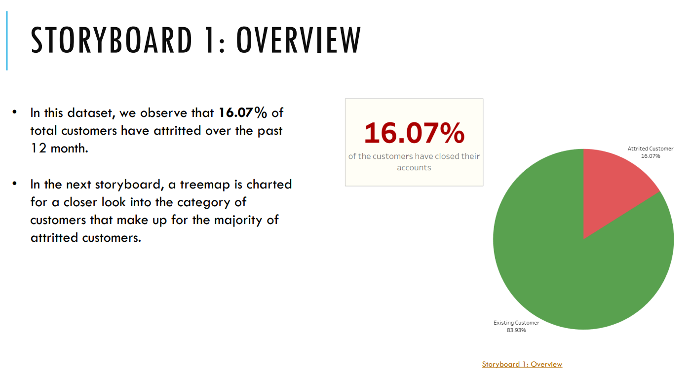
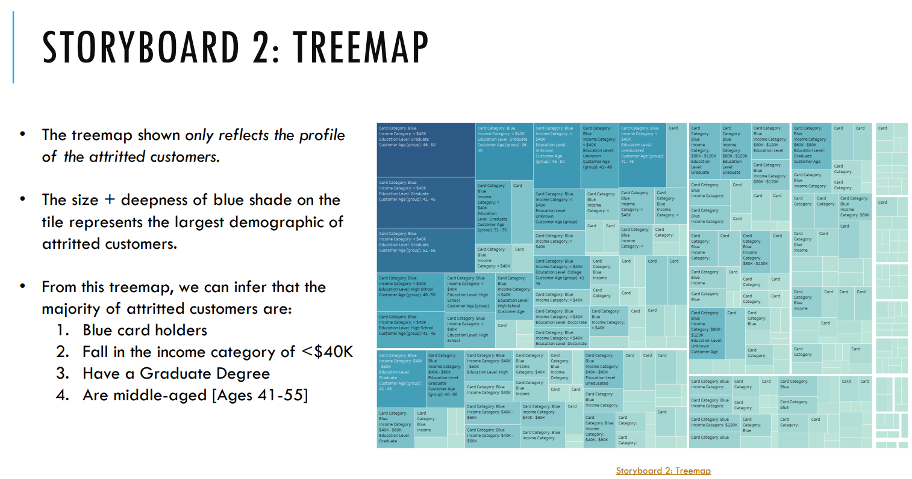
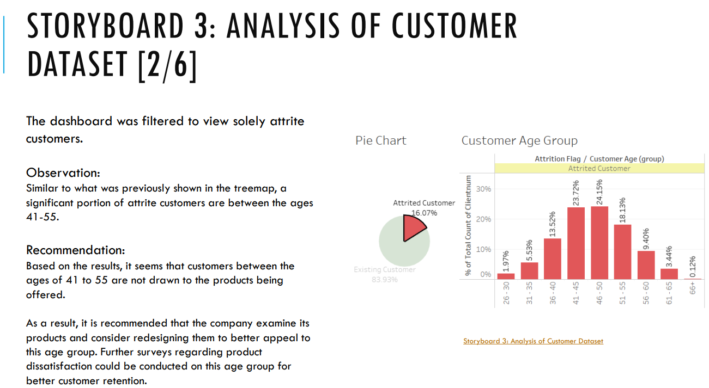
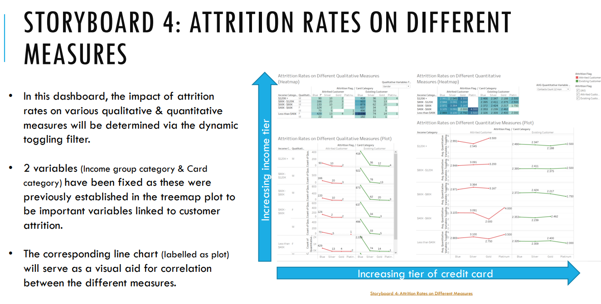

# Analysis of Credit Card Churning Customers * [Tableau, Powerpoint] *

[GitHub Powerpoint link](Vertical_Institute_Yong_Sook_Prasit_Attavit_CapstoneProject_GitHub.pdf)  |  [Google Drive PowerPoint Link](https://drive.google.com/file/d/1xLoupFLQ58gDDiqBUWum-zmTTU3uJUhm/view?usp=sharing)  |  [GitHub Repository Link](https://github.com/YongSookPrasitAttavit/VI_Capstone_Credit-Card-Customers_Predict-Churning-Customers/tree/main)

The dataset used in this analysis was obtained from [Kaggle](https://www.kaggle.com/datasets/sakshigoyal7/credit-card-customers?datasetId=982921). It contains information for more than 10,000 customers mentioning their age, salary, credit limit, attrition status, etc. with 23 columns.

The interactive Tableau Storyboard created for this project can be found in the link below [Best Viewed when downloaded & viewed natively in **Tableau** on a ~24" monitor] :  
- [Tableau Storyboard Link](https://public.tableau.com/app/profile/ysook/viz/VI_CapstoneProject_16798032083060/Storyboard)

## Background
A business manager of a consumer credit card portfolio is confronted with the challenge of customer attrition.

He would like to analyze the data to find out the underlying cause of this issue, and to leverage the findings to anticipate customers who are at risk of leaving. Furthermore, he would also like to know of any suggestions as to how to retain their customers.

The purpose of this study is to establish associations within the data to identify the demographic group most prone to experience credit card attrition.  

This approach will enable the credit card company to proactively engage with customers to deliver improved services and influence their decisions towards retaining the card.

Analysis of attritted customers were performed based on various qualitative & quantitative measures. Relevant recommendations that the bank can undertake to alleviate churning customers were proposed. Limitations of the dataset which may lead to analytics bias was also discussed.

Visualizations utilizing Treemaps, Boxplots, Scatter Plots, Pie Charts, Heatmaps were made in Tableau for data analysis:

